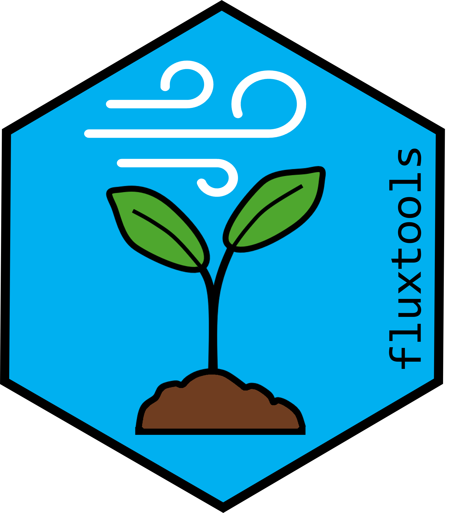
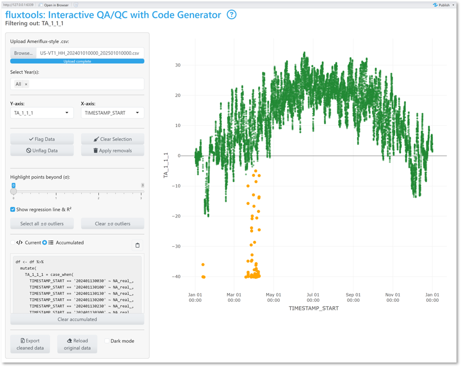
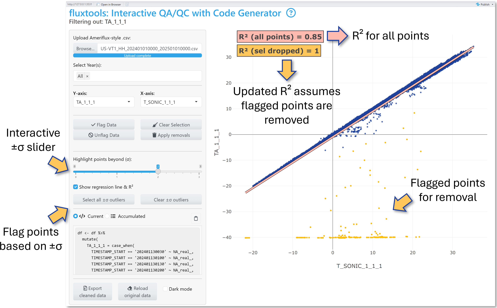

# Summary
Eddy covariance data processing requires extensive quality control (QA/QC) to identify and remove implausible or erroneous half-hourly flux data before submission to public data repositories such as [AmeriFlux](https://ameriflux.lbl.gov/) [@ameriflux]. 
[*Fluxtools*](https://github.com/kesondrakey/fluxtools) [@Fluxtools] is an R (\(\ge\) 4.5.0; -@R) *Shiny* [@Shiny] application built with *Plotly* [@Plotly] and *dplyr* [@dplyr] packages designed to streamline this workflow by providing interactive visualization, year-based filtering, and on-the-fly R code generation for specified data removal. Users can visually flag anomalous data points (i.e., periods of sensor failure, physically implausible data), accumulate multiple cleaning steps, inspect R² values before and after data cleaning via base R’s  [*lm()* ](https://www.rdocumentation.org/packages/stats/versions/3.6.2/topics/lm) function, and export a zipped folder containing a cleaned .csv file and a full R script that records every decision. *Fluxtools* significantly accelerates the QA/QC workflow, ensuring transparent, reproducible, and shareable data cleaning suitable for final dataset preparation and repository submission. 


{ width=30% .center }

## Key features: 
- **Interactive Plotly Scatterplots**: Plot any numeric or time variable; hover mouse over data points to see timestamps and values; export plots as .png directly from the app 

- **Flexible point selection**: Select data points via box, lasso, or by standard-deviation (σ) cutoffs. *Fluxtools* provides auto generated removal code for selected points visible in the *Current* code box with ready-to-copy R code using *dplyr’s case_when(… ~ NA)* snippets generate in the *current* code box automatically. *See Fig 2* for interface and data selection example 

{#fig:2 width=100%}

- **On-the-fly R code generation**: Flagged points, using the *Flag Data* button tool, automatically highlights selections in yellow and adds these values into the *Accumulated* code box for easy and continuous data selection. 

<!-- The *Preview* pane shows selected timestamps and values; ready-to-copy R code using *dplyr’s case_when(… ~ NA)* snippets generate in the *current* code box automatically; *add current selection* adds code to the *accumulated* code box for easy and continuous data selection  -->

- **Before/after R² diagnostics**: For any numeric variable comparison, *Fluxtools* fits a linear regression model and reports its R² value. 
Selecting points re-computes R² as if those points were removed, allowing for easy comparison. *Fig 3* shows this process in *Fluxtools* using the *±σ outliers selection tool:* The top (red) R² uses all data, while the bottom R² (orange) omits selected points from the linear regression.

{#fig:3 width=100%}

- **Export cleaned .csv file and R script**: *Apply removals* in-app (converting data points into *NA*s for selected timestamps) then *Export cleaned data* to download a cleaned .csv file and a comprehensive R script documenting each data removal step 


# Statement of need  
High-frequency (10 Hz; data recorded 10 times per second) eddy covariance measurements generate large datasets that must be aggregated into half-hourly fluxes, using careful quality assurance and quality control [@Burba2021]. At this high frequency, intermittent periods of sensor drift or failure are common, making manual data cleaning an integral part of the workflow. Tools like *EddyPro* [@EddyPro] convert raw 10Hz data into half-hourly fluxes, while R packages like *REddyProc* [@Reddyproc], and Python tools like PyFluxPro [@PyFluxPro], automate u*-threshold filtering, gap-filling, and flux partitioning. These tools excel at bulk data processing but offer no interactive means to inspect or carefully remove outliers that require a human eye.

In practice, data managers resort to custom scripts, extensive manual visualization, and fragmented documentation to detect and remove erroneous data points caused by sensor drift, malfunction, or calibration issues. These procedures are labor-intensive, prone to errors, challenging to reproduce, and lack transparency. *Fluxtools* addresses this challenge by pairing an interactive scatterplot-based interface with on-the-fly R code generation. Users can visually flag implausible half-hourly data points, automatically generate the exact *case_when(... ~ NA) dplyr* code snippets (or apply removals automatically in the app) and export a .zip file containing a cleaned .csv file plus a comprehensive R script documenting each data removal step that captures every user-made QA/QC decision.

*Fluxtools* streamlines and clarifies this QA/QC workflow by combining interactivity with code-based reproducibility. It promotes transparent documentation of decisions, reduces manual effort, and accelerates the preparation of flux data for repository uploads such as individual site submissions to AmeriFlux. Ultimately, *Fluxtools* lowers the barriers to robust and reproducible QA/QC workflows, enabling researchers to devote less time to manual anomaly detection and more time to scientific analysis.


# Code Example
*Fluxtools can be installed from [Github](https://github.com/kesondrakey/fluxtools).*

```{r How-to, eval=FALSE}
library(fluxtools)
#Set your site’s UTC offset (e.g., –5 for Eastern Standard Time)
fluxtools::run_flux_qaqc(-5)
```

# Acknowledgments 
Fluxtools is an independent project developed in my role as Co-Principal Investigator for the AmeriFlux [US-VT1](https://ameriflux.lbl.gov/sites/siteinfo/US-VT1) [@VT1] and [US-VT2](https://ameriflux.lbl.gov/sites/siteinfo/US-VT2) [@VT2] sites to streamline our QA/QC pipeline. I thank AmeriFlux for maintaining clear, up-to-date data‐formatting specifications (see [AmeriFlux Data Variables](https://ameriflux.lbl.gov/wp-content/uploads/2015/10/AmeriFlux_DataVariables.pdf)) and I acknowledge the broader *R* and *Shiny* communities for their efforts in advancing interactive data‐visualization tools.  

I am grateful to Dr. Kim Novick (Indiana University), Housen Chu (AmeriFlux), and Benju Baniya (Texas A&M University) for their invaluable expertise in assisting with the AmeriFlux data processing workflow. Without their support, this data pipeline would not have been possible. I also thank Dr. Mallory Barnes, Dr. Daniel Beverly, and Dr. Xian Wang (all at Indiana University) for their support during development and testing. Special thanks goes to George Burba (LI-COR Biosciences) for his encouragement and for insightful discussions that have helped shape the future of *Fluxtools*.

This work was supported by NSF's Division of Environmental Biology (DEB) Dynamics of Socio-Environmental Systems Program (Award 22-06086) and NASA’s Carbon Monitoring System (Award 80NSSC23K1254). 

Partial development of the Fluxtools application logic, debugging assistance, and initial code drafting were supported by OpenAI’s *GPT-4-mini-high* large language model [@ChatGPT]. All final code and revisions were authored and approved by the human author.

# References 
