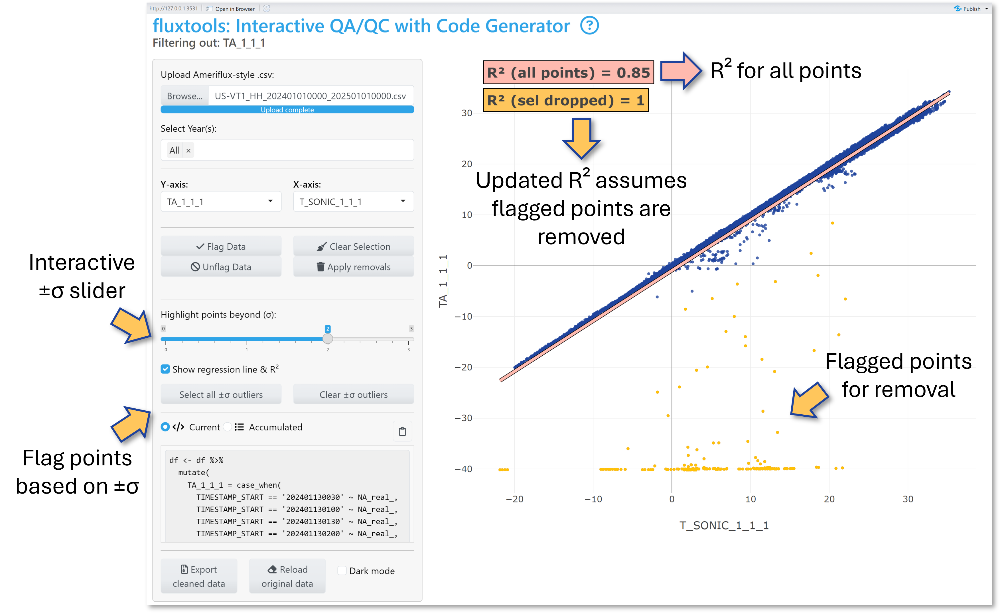

# Summary

Eddy covariance data processing (Burba 2021) requires extensive quality
control QA/QC to identify and remove implausible or erroneous
half-hourly flux data before submission to public data repositories
(i.e., [Ameriflux](https://ameriflux.lbl.gov/)) .
[Fluxtools](https://github.com/kesondrakey/fluxtools) (Key 2025) is an R
(≥ 4.5.0) Shiny application (required packages:
[*Shiny*](https://cran.r-project.org/web/packages/shiny/index.html)
(Chang et al. 2024),
[*Plotly*](https://cran.r-project.org/web/packages/plotly/index.html)
(Sievert et al. 2024),
[*dplyr*](https://cran.r-project.org/web/packages/dplyr/index.html)
(Wickham et al. 2023)) specifically designed to streamline this QA/QC
process by providing interactive visualization, year-based filtering,
and on-the-fly R code generation. This allows data managers the ability
to visually pinpoint “bad” data (i.e., sensors went down, physically
implausible data) and immediately extract reproducible removal snippets.
With a few clicks, you can accumulate multiple removal steps, inspect
before/after R2 values via base R’s
[*lm()*](https://www.rdocumentation.org/packages/stats/versions/3.6.2/topics/lm),
and export both a cleaned .csv file and a full R script for data removal
code. *Fluxtools* significantly accelerates the QA/QC workflow, ensuring
transparent, reproducible, and shareable data cleaning suitable for
final dataset preparation and repository submission (i.e., Ameriflux
sites like [US-VT1](https://ameriflux.lbl.gov/sites/siteinfo/US-VT1)
(AmeriFlux 2025a) and
[US-VT2](https://ameriflux.lbl.gov/sites/siteinfo/US-VT2) (AmeriFlux
2025b)).

<figure>

<figcaption aria-hidden="true"><em>Fluxtools</em> hex logo </figcaption>
</figure>

## Key features:

**Interactive Plotly Scatterplots**: Plot any numeric or time variable;
hover mouse over individual datapoints to see timestamps and point
values; export plots as .png directly from the app

**Flexible point selection**: Select suspicious data points using a box,
lasso, or by standard-deviation (σ) cutoffs. *See Fig 2* for interface
and data selection example

**On-the-fly R code generation**: *Preview* pane shows selected
timestamps and values; ready-to-copy R code using *dplyr’s case_when(… ~
NA_real)* snippets generate in the *current* code box automatically;
*add current selection* adds code to the *accumulated* code box for easy
and continuous data selection

**Before/after R² diagnostics**: When variables are compared against
each other, a linear regression generates a R² value. Automatically
computes post-removal R² value where selected data points are dropped to
see step comparisons. *See Fig 3* for an example of the *Fluxtools*
interfacing using the ±σ outliers selection tool. The top (red) R² is
for all data points and the bottom R² (orange) is when selected points
are dropped from the linear regression model

**Export a cleaned CSV**: Download a cleaned CSV, where *apply removals*
turns data points into “NA”, with a comprehensive R script documenting
each data removal step

By reducing manual scripting and visual inspections, *Fluxtools*
promotes reproducible, transparent, and efficient QA/QC workflows,
greatly simplifying data preparation for Ameriflux and similar data
repositories.

<figure id="fig:2">

<figcaption aria-hidden="true">Example of the <em>Fluxtools</em>
interface and data selection</figcaption>
</figure>

<figure id="fig:3">

<figcaption aria-hidden="true">Example of R² diagnostics using the ±σ
outliers cutoffs and selection</figcaption>
</figure>

# Statement of need

High-frequency (10 Hz; data recorded 10 times per second) eddy
covariance measurements produce large datasets that must be aggregated
carefully into half-hourly fluxes, requiring meticulous quality
assurance and quality control. Traditional QA/QC workflows typically
involve multiple custom scripts, extensive manual visualization,
fragmented documentation, and significant effort to detect and remove
erroneous data points caused by sensor drift, malfunction, or
calibration issues. These procedures are labor-intensive, prone to
errors, challenging to reproduce, and lack transparency.

*Fluxtools* addresses these challenges by providing an interactive
scatterplot-based interface paired with automatic, reproducible R code
generation. Users can visually flag implausible half-hourly data points,
automatically generate the exact *case_when(… ~ NA_real\_) dplyr*
snippets needed to set those points to NA, and either copy and paste the
code for their removal into their own R script or remove them
immediately in the app and export a .zip file containing a cleaned CSV
plus a comprehensive R script documenting each step. This workflow
guarantees transparency and reproducibility.

By combining interactivity with code-based reproducibility, *Fluxtools*
significantly streamlines and clarifies the QA/QC workflow. It promotes
transparent documentation of decisions, reduces manual effort, and
accelerates the preparation of flux data for repository uploads such as
Ameriflux (i.e., sites like
[US-VT1](https://ameriflux.lbl.gov/sites/siteinfo/US-VT1) and
[US-VT2](https://ameriflux.lbl.gov/sites/siteinfo/US-VT2)). Ultimately,
Fluxtools lowers the barriers to robust and reproducible QA/QC
workflows, enabling researchers to devote less time to manual anomaly
detection and more time to scientific analysis.

## How to

``` r
library(fluxtools)

fluxtools::run_flux_qaqc(-5) # To run the app, replace ‘-5’ with your site’s UTC offset (e.g., –5 is for EST) 
```

# Acknowledgments

This application was developed in my role as Co-Principal Investigator
for the AmeriFlux US-VT1 and US-VT2 sites to streamline our QA/QC
pipeline. I thank Ameriflux for maintaining clear, up-to-date
data‐formatting specifications (see [Ameriflux Data
Variables](https://ameriflux.lbl.gov/wp-content/uploads/2015/10/AmeriFlux_DataVariables.pdf))
and I acknowlege the broader R and Shiny communities for their efforts
in advancing interactive data‐visualization tools.

I am grateful to Dr. Kim Novick (Indiana University), Housen Chu
(Ameriflux), and Benju Baniya (Texas A&M University) for their
invaluable expertise in assisting with the Ameriflux data processing
workflow. Without their support, this data pipeline would not have been
possible. I also thank Dr. Mallory Barnes, Dr. Daniel Beverly, and
Dr. Xian Wang (all at Indiana University) for their support during
development and testing. Special thanks goes to George Burba (LI-COR
Biosciences) for his encouragement and for insightful discussions that
have helped shape the future of *Fluxtools*.

This work was supported by NSF’s Division of Environmental Biology (DEB)
Dynamics of Socio-Environmental Systems Program (Award 22-06086) and
NASA’s Carbon Monitoring System (Award 80NSSC23K1254).

Partial development of the *Fluxtools* application logic, debugging
assistance, and initial code drafting were supported by [OpenAI’s
ChatGPT:
GPT-4-mini-high](https://openai.com/index/introducing-o3-and-o4-mini/)
(OpenAI 2025). All final code and revisions were authored and approved
by the human author.

# References

<div id="refs" class="references csl-bib-body hanging-indent"
entry-spacing="0">

<div id="ref-US-VT1" class="csl-entry">

AmeriFlux. 2025a. “Site Info for US-VT1.”
<https://ameriflux.lbl.gov/sites/siteinfo/US-VT1>.

</div>

<div id="ref-US-VT2" class="csl-entry">

———. 2025b. “Site Info for US-VT2.”
<https://ameriflux.lbl.gov/sites/siteinfo/US-VT2>.

</div>

<div id="ref-Burba2021" class="csl-entry">

Burba, George. 2021. *Eddy Covariance Method - for Scientific,
Regulatory, and Commercial Applications*. Lincoln, Nebraska: LI-COR
Biosciences. <https://www.licor.com/products/eddy-covariance/ec-book>.

</div>

<div id="ref-Shiny" class="csl-entry">

Chang, Winston, Joe Cheng, J. J. Allaire, Carson Sievert, Barret
Schloerke, Yihui Xie, Jeff Allen, et al. 2024. “Shiny: Web Application
Framework for R.”
<https://cran.r-project.org/web/packages/shiny/index.html>.

</div>

<div id="ref-Fluxtools" class="csl-entry">

Key, Kesondra. 2025. “<span class="nocase">fluxtools</span>: Interactive
QA/QC for AmeriFlux Data.” *GitHub Repository*.
<https://github.com/kesondrakey/fluxtools>.

</div>

<div id="ref-ChatGPT" class="csl-entry">

OpenAI. 2025. “Introducing OpenAI O3 and O4-Mini.”
<https://openai.com/index/introducing-o3-and-o4-mini/>.

</div>

<div id="ref-Plotly" class="csl-entry">

Sievert, Carson, Chris Parmer, Toby Hocking, Scott Chamberlain, Karthik
Ram, Marianne Corvellec, Pedro Despouy, Salim Brüggemann, and Plotly
Technologies Inc. 2024. “Plotly: Create Interactive Web Graphics via
’Plotly.js’.”
<https://cran.r-project.org/web/packages/plotly/index.html>.

</div>

<div id="ref-dplyr" class="csl-entry">

Wickham, Hadley, Romain François, Lionel Henry, Kirill Müller, Davis
Vaughan, Posit Software, and PBC. 2023. “Dplyr: A Grammar of Data
Manipulation.”
<https://cran.r-project.org/web/packages/dplyr/index.html>.

</div>

</div>
