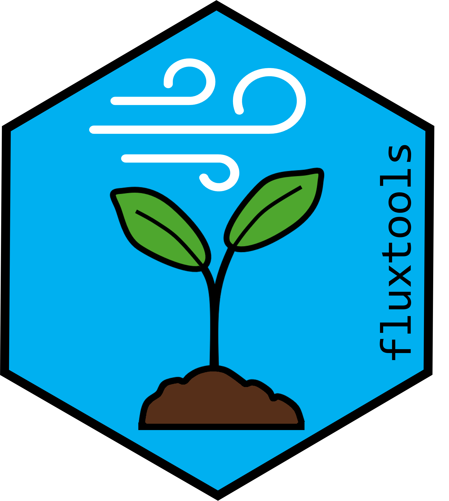
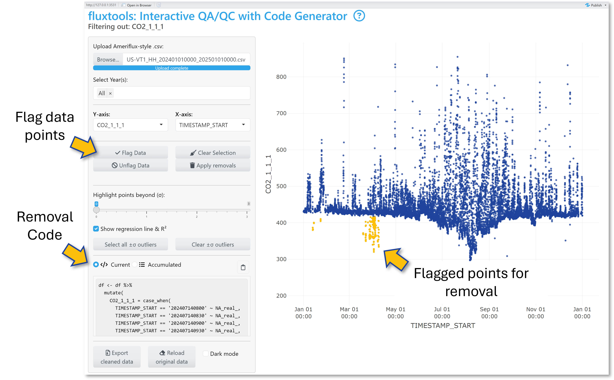

# Summary

Eddy covariance data processing requires extensive quality control
(QA/QC) to identify and remove implausible or erroneous half-hourly flux
data before submission to public data repositories such as
[AmeriFlux](https://ameriflux.lbl.gov/) ([AmeriFlux Management Project
2025](#ref-ameriflux)).
[*Fluxtools*](https://github.com/kesondrakey/fluxtools) ([Key
2025](#ref-Fluxtools)) is an R (≥ 4.5.0; ([2025](#ref-R))) *Shiny*
([Chang et al. 2024](#ref-Shiny)) application built with *Plotly*
([Sievert et al. 2024](#ref-Plotly)) and *dplyr* ([Wickham et al.
2023](#ref-dplyr)) packages designed to streamline this workflow by
providing interactive visualization, year-based filtering, and
on-the-fly R code generation for specified data removal. Users can
visually flag anomalous data points (i.e., periods of sensor failure,
physically implausible data), accumulate multiple cleaning steps,
inspect R² values before and after data cleaning via base R’s
[*lm()*](https://www.rdocumentation.org/packages/stats/versions/3.6.2/topics/lm)
function, and export a zipped folder containing a cleaned .csv file and
a full R script that records every decision. *Fluxtools* significantly
accelerates the QA/QC workflow, ensuring transparent, reproducible, and
shareable data cleaning suitable for final dataset preparation and
repository submission.

<figure>

<figcaption aria-hidden="true"><em>Fluxtools</em> hex logo </figcaption>
</figure>

## Key features:

- **Interactive Plotly Scatterplots**: Plot any numeric or time
  variable; hover mouse over data points to see timestamps and values;
  export plots as .png directly from the app

- **Flexible point selection**: Box-select, lasso, or apply
  standard-deviation (σ) cutoffs to mark selected points. *Fluxtools*
  automatically generates removal ready-to-copy R snippets
  (*dplyr::case_when(… ~ NA)*) in the *Current* code pane. *See Fig 2*
  for interface and data selection example

- **On-the-fly R code generation**: After point selection, clicking
  *Flag Data* automatically highlights chosen points in yellow and
  appends the corresponding removal code into the *Accumulated* code
  panel for easy and continuous data selection

<figure id="fig:2">

<figcaption aria-hidden="true">Example of the <em>Fluxtools</em>
interface and data selection</figcaption>
</figure>

- **Before/after R² diagnostics**: For any numeric variable comparison,
  *Fluxtools* fits a linear regression model and reports its R² value.
  Selecting points re-computes R² as if those points were removed,
  allowing for easy comparison. *Fig 3* shows this process in
  *Fluxtools* using the *±σ outliers selection tool:* The top (red) R²
  uses all data, while the bottom R² (orange) omits selected points from
  the linear regression

<figure id="fig:3">

<figcaption aria-hidden="true">Example of R² diagnostics using the ±σ
outliers cutoffs and selection</figcaption>
</figure>

- **Export cleaned .csv file and R script**: *Apply removals* in-app
  (converting data points into *NA*s for selected timestamps) then
  *Export cleaned data* to download a cleaned .csv file and a
  comprehensive R script documenting each data removal step

# Statement of need

High-frequency (10Hz; data recorded 10x per second) eddy covariance
measurements generate large datasets that must be aggregated into
half-hourly fluxes, using careful QA/QC ([Burba 2021](#ref-Burba2021)).
At this high temporal resolution, intermittent periods of sensor drift
or failure are common, making manual data cleaning an integral part of
the workflow.

Tools like *Loggernet’s CardConvert* feature ([Campbell Scientific, Inc.
2025](#ref-Loggernet)) convert raw 10Hz eddy covariance data into
half-hourly intervals, preparing them for flux estimation. Software like
*EddyPro* ([LI-COR Biosciences 2021](#ref-EddyPro)) then computes
turbulent fluxes of CO₂, H₂O, and energy using these half-hourly inputs.
Post-processing *R* packages like *REddyProc* ([Wutzler et al.
2024](#ref-Reddyproc)), and Python tools like PyFluxPro ([Isaac
2021](#ref-PyFluxPro)), automate u\*-threshold filtering, gap-filling,
and flux partitioning. These tools excel at bulk data processing but
offer no interactive means to inspect or carefully remove outliers that
require a human eye.

In practice, data managers resort to custom scripts, manual
visualization, and fragmented documentation to detect and remove
erroneous data points caused by sensor drift, malfunction, or
calibration issues. These procedures are labor-intensive, error-prone,
difficult to reproduce, and lack transparency. *Fluxtools* addresses
these challenges by pairing an interactive scatterplot-based interface
with on-the-fly R code generation. Users can visually flag implausible
half-hourly data points, automatically generate or directly apply the
exact *case_when(… ~ NA) dplyr* code snippets and export a .zip file
containing a cleaned .csv file plus a comprehensive R script documenting
each QA/QC decision.

By combining interactivity with code-based reproducibility, *Fluxtools*
streamlines QA/QC workflows by enhancing transparency, reducing manual
effort, and accelerating the preparation of flux data for repository
submissions (e.g., Ameriflux). Ultimately, *Fluxtools* lowers the
barriers to robust and reproducible QA/QC, allowing data managers and
scientists to spend less time on manual anomaly detection and more on
scientific analysis and interpretation.

# Code Example

*Fluxtools can be installed from
[Github](https://github.com/kesondrakey/fluxtools).*

## Installation

``` r
# Option 1.) Install from CRAN (Fluxtools R Package submission pending)
#install.packages("fluxtools")

# Option 2.) Install most recent version from GitHub
library(remotes)
remotes::install_git("https://github.com/kesondrakey/fluxtools.git")
```

## Call the Fluxtools App

``` r
library(fluxtools)

#Set your site’s UTC offset (e.g., –5 for Eastern Standard Time)
fluxtools::run_flux_qaqc(-5)
```

# Acknowledgments

Fluxtools is an independent project developed in my role as Co-Principal
Investigator for the AmeriFlux
[US-VT1](https://ameriflux.lbl.gov/sites/siteinfo/US-VT1) ([Key and
Novick 2025a](#ref-VT1)) and
[US-VT2](https://ameriflux.lbl.gov/sites/siteinfo/US-VT2) ([Key and
Novick 2025b](#ref-VT2)) sites to streamline our QA/QC pipeline. I thank
AmeriFlux for maintaining clear, up-to-date data‐formatting
specifications (see [AmeriFlux Data
Variables](https://ameriflux.lbl.gov/wp-content/uploads/2015/10/AmeriFlux_DataVariables.pdf))
and I acknowledge the broader *R* and *Shiny* communities for their
efforts in advancing interactive data‐visualization tools.

I am grateful to Dr. Kim Novick (Indiana University), Housen Chu
(AmeriFlux), and Benju Baniya (Texas A&M University) for their
invaluable expertise in assisting with the AmeriFlux data processing
workflow. Without their support, this data pipeline would not have been
possible. I also thank Dr. Mallory Barnes, Dr. Daniel Beverly, and
Dr. Xian Wang (all at Indiana University) for their support during
development and testing. Special thanks goes to George Burba (LI-COR
Biosciences) for his encouragement and for insightful discussions that
have helped shape the future of *Fluxtools*.

This work was supported by NSF’s Division of Environmental Biology (DEB)
Dynamics of Socio-Environmental Systems Program (Award 22-06086) and
NASA’s Carbon Monitoring System (Award 80NSSC23K1254).

Partial development of the Fluxtools application logic, debugging
assistance, and initial code drafting were supported by OpenAI’s
*GPT-4-mini-high* large language model ([OpenAI 2025](#ref-ChatGPT)).
All final code and revisions were authored and approved by the human
author.

# References

<div id="refs" class="references csl-bib-body hanging-indent"
entry-spacing="0">

<div id="ref-ameriflux" class="csl-entry">

AmeriFlux Management Project. 2025. “AmeriFlux Data Portal.” 2025.
<https://ameriflux.lbl.gov/>.

</div>

<div id="ref-Burba2021" class="csl-entry">

Burba, George. 2021. *Eddy Covariance Method - for Scientific,
Regulatory, and Commercial Applications*. Lincoln, Nebraska: LI-COR
Biosciences. <https://www.licor.com/products/eddy-covariance/ec-book>.

</div>

<div id="ref-Loggernet" class="csl-entry">

Campbell Scientific, Inc. 2025. “LoggerNet: Datalogger Support
Software.” <https://www.campbellsci.com/loggernet>.

</div>

<div id="ref-Shiny" class="csl-entry">

Chang, Winston, Joe Cheng, JJ Allaire, Carson Sievert, Barret Schloerke,
Yihui Xie, Jeff Allen, Jonathan McPherson, Alan Dipert, and Barbara
Borges. 2024. *Shiny: Web Application Framework for r*.
<https://doi.org/10.32614/CRAN.package.shiny>.

</div>

<div id="ref-PyFluxPro" class="csl-entry">

Isaac, Peter. 2021. “PyFluxPro.” <https://github.com/OzFlux/PyFluxPro>.

</div>

<div id="ref-Fluxtools" class="csl-entry">

Key, Kesondra. 2025. “Fluxtools: Interactive QA/QC for Eddy Covariance
Data.” Zenodo. <https://doi.org/10.5281/zenodo.15626645>.

</div>

<div id="ref-VT1" class="csl-entry">

Key, Kesondra, and Kim Novick. 2025a. “AmeriFlux BASE US-VT1 Vermillion
Tributary Paired Cropland – Site 1 (Corn/Soy; No Cover Crops).”
AmeriFlux Network, Lawrence Berkeley National Laboratory.
<https://doi.org/10.17190/AMF/2567994>.

</div>

<div id="ref-VT2" class="csl-entry">

———. 2025b. “AmeriFlux BASE US-VT2 Vermillion Tributary Paired Cropland
– Site 2 (Corn/Soy; Cover Crops).” AmeriFlux Network, Lawrence Berkeley
National Laboratory. <https://doi.org/10.17190/AMF/2567995>.

</div>

<div id="ref-EddyPro" class="csl-entry">

LI-COR Biosciences. 2021. “EddyCovariance Processing Software
(EddyPro).”
<https://www.licor.com/env/products/eddy-covariance/eddypro>.

</div>

<div id="ref-ChatGPT" class="csl-entry">

OpenAI. 2025. “Introducing OpenAI O3 and O4-Mini.” 2025.
<https://openai.com/index/introducing-o3-and-o4-mini/>.

</div>

<div id="ref-R" class="csl-entry">

R Core Team. 2025. *R: A Language and Environment for Statistical
Computing*. Vienna, Austria: R Foundation for Statistical Computing.
<https://www.R-project.org/>.

</div>

<div id="ref-Plotly" class="csl-entry">

Sievert, Carson, Chris Parmer, Toby Hocking, Scott Chamberlain, Karthik
Ram, Marianne Corvellec, Pedro Despouy, Salim Brüggemann, and Plotly
Technologies Inc. 2024. “Plotly: Create Interactive Web Graphics via
’Plotly.js’.” <https://doi.org/10.32614/CRAN.package.plotly>.

</div>

<div id="ref-dplyr" class="csl-entry">

Wickham, Hadley, Romain François, Lionel Henry, Kirill Müller, and Davis
Vaughan. 2023. *Dplyr: A Grammar of Data Manipulation*.
<https://doi.org/10.32614/CRAN.package.dplyr>.

</div>

<div id="ref-Reddyproc" class="csl-entry">

Wutzler, Thomas, Markus Reichstein, Antje Maria Moffat, and Mirco
Migliavacca. 2024. *REddyProc: Post Processing of (Half-)hourly
Eddy-Covariance Measurements*.
<https://doi.org/10.32614/CRAN.package.REddyProc>.

</div>

</div>
